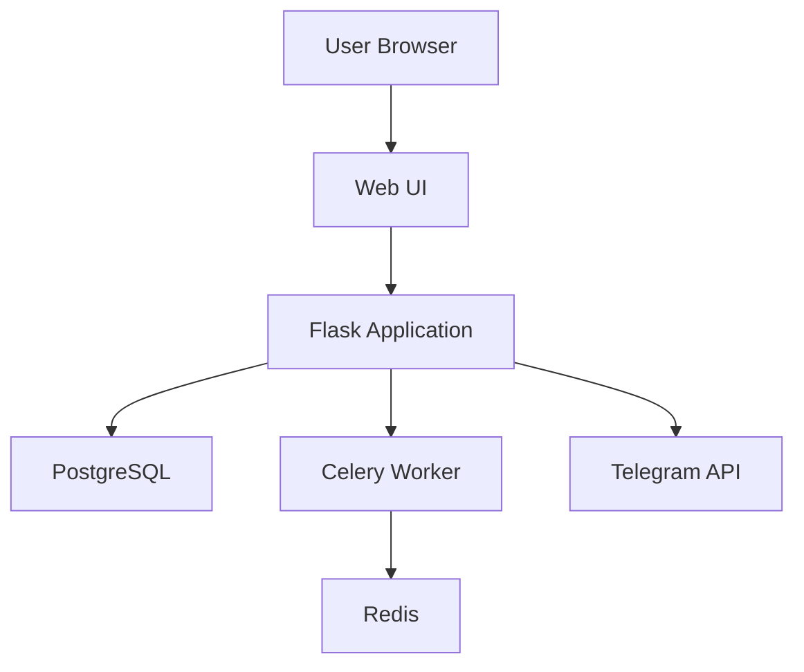

# System Architecture

## Component Diagram

## Key Components
1. **Web Layer**: Flask with Materialize CSS
2. **Business Logic**: Celery task queue for bot processes
3. **Data Layer**: SQLAlchemy ORM with PostgreSQL
4. **Bot Control**: Isolated Python-telegram-bot instances
5. **Auth**: Flask-Login with role-based access